# Batak – Türkçe İhaleli Batak Oyunu

Android için Kotlin ve Jetpack Compose ile geliştirilmiş, tamamen Türkçe, çevrimdışı oynanabilen
4 kişilik **İhaleli Batak** kart oyunu. Oyuncuya 3 yapay zekâ rakip eşlik eder.
**Eşsiz (tek)** ve **Eşli (2v2)** oyun modları desteklenir.

## Ekran Görüntüleri

| Ana Menü | İhale | Koz Seçimi | Kart Seçimi |
|---|---|---|---|
| 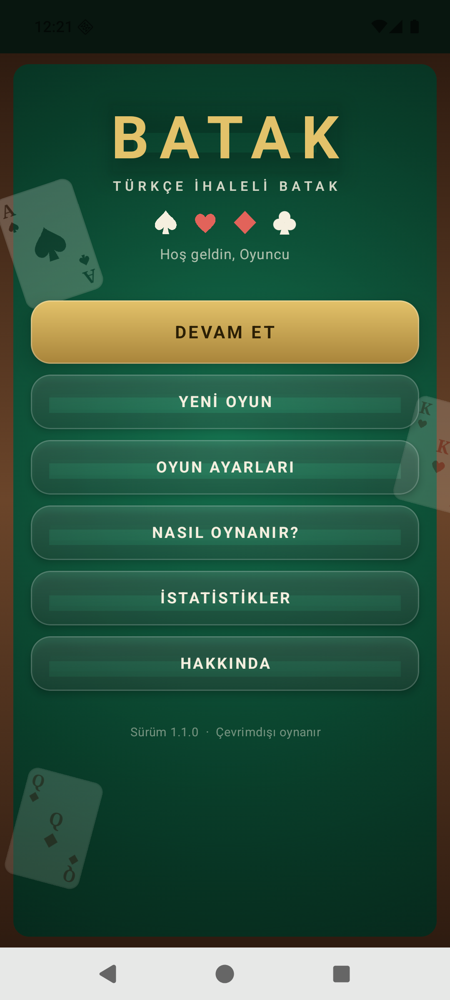 | 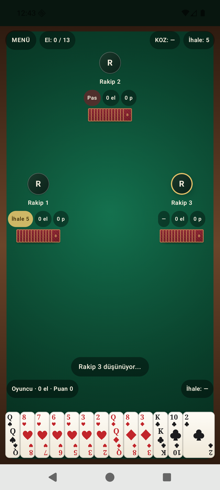 | 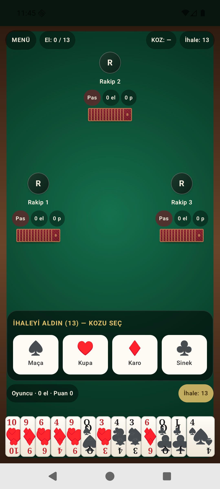 | 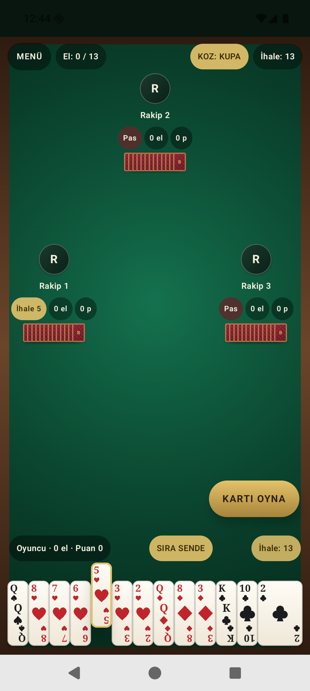 |

| Eşli Mod (2v2) | El Sonucu | Oyun Sonu | Ayarlar |
|---|---|---|---|
| 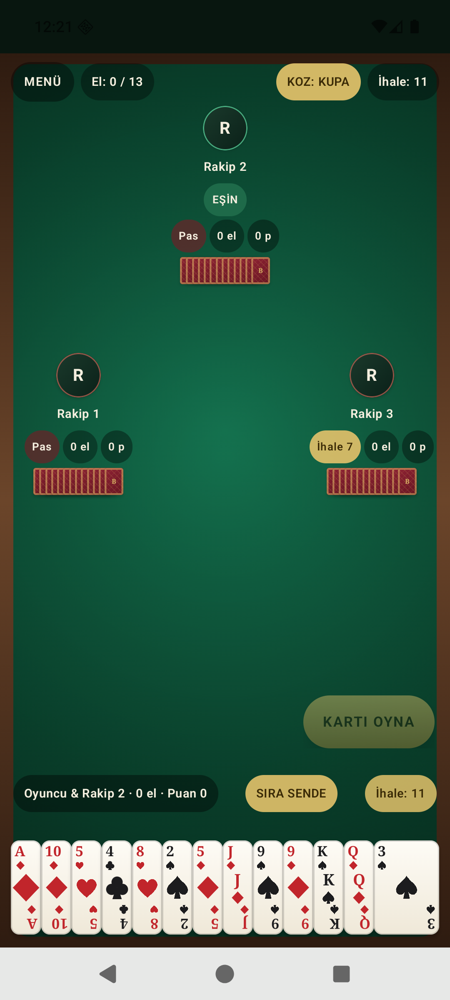 | 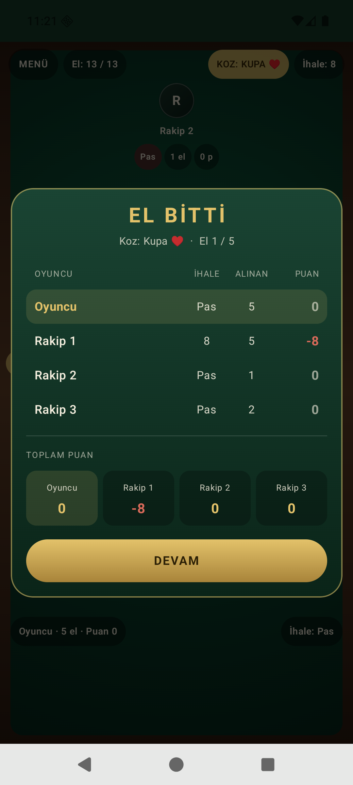 | 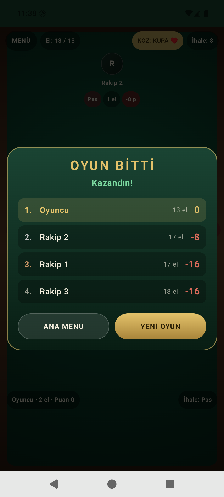 | 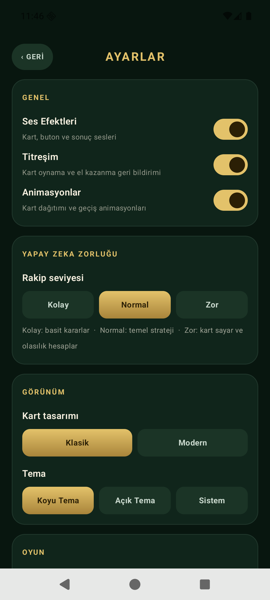 |

| İstatistikler | Nasıl Oynanır | Açık Tema | Masa |
|---|---|---|---|
| 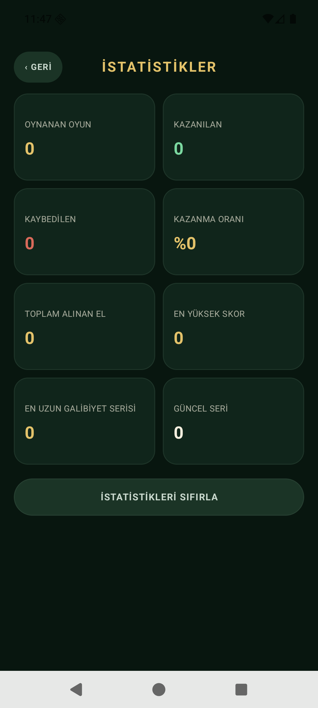 | 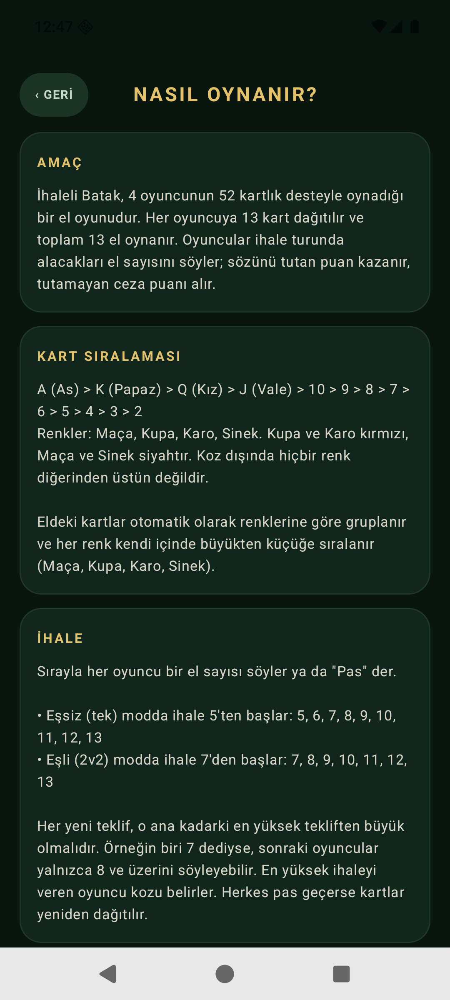 | 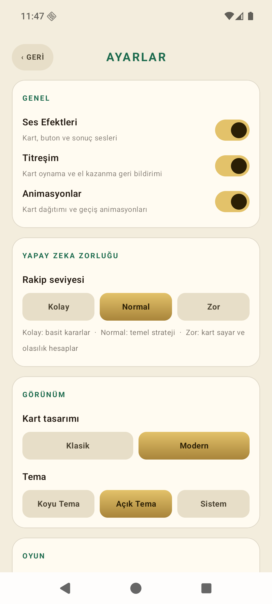 | 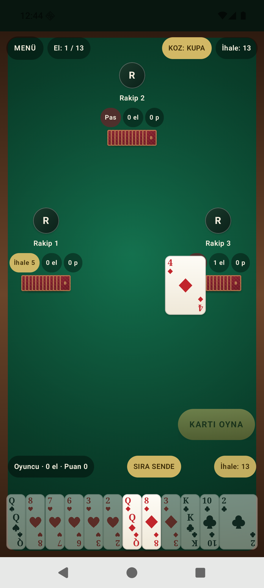 |

## Uygulama Nedir?

Geleneksel Türk **İhaleli Batak** oyununun modern bir mobil sürümüdür. 52 kartlık deste,
4 oyuncu, 13 el. Oyuncular sırayla ihale verir (5–13 veya Pas), en yüksek ihaleyi alan kozu
belirler ve herkes sözünü tutmaya çalışır.

- **Tamamen çevrimdışı** çalışır, internet gerektirmez.
- **Tamamen Türkçe** arayüz.
- **İki oyun modu**: Eşsiz (tek) ve Eşli (2v2).
- **3 zorluk seviyesi**: Kolay, Normal, Zor.
- Modern poker masası görünümü, akıcı animasyonlar, ses efektleri ve titreşim.

## Özellikler

- 52 kartlık gerçek deste, doğru kart sıralaması (A > K > Q > J > 10 … > 2)
- Eldeki kartlar renklerine göre gruplanır, her renk kendi içinde büyükten küçüğe sıralanır
- Sıralı ihale sistemi (Eşsiz modda 5–13, Eşli modda 7–13, geçersiz teklifler engellenir)
- Koz seçimi (♠ Maça, ♥ Kupa, ♦ Karo, ♣ Sinek)
- Takım rengi zorunluluğu ve **kart yükseltme zorunluluğu**
- Eşli modda takım oyunu: eşin elini kazanmasına engel olmayan yapay zekâ
- Kart takibi yapan, ele göre ihale veren üç seviyeli yapay zekâ
- Animasyonlu kart dağıtımı, kart oynama ve el vurgusu
- Ses efektleri (dağıtma, oynama, ihale, el kazanma/kaybetme) ve titreşim
- Kalıcı istatistikler (oynanan/kazanılan oyun, el sayısı, en yüksek skor, seriler)
- Otomatik oyun kaydı ve **Devam Et** desteği
- Koyu / Açık tema, iki kart tasarımı, oyuncu adı, el sayısı ve ses/titreşim ayarları

## Nasıl Çalıştırılır?

### Gereksinimler

- Android Studio (Ladybug veya üzeri) ya da JDK 17+ ve Android SDK
- Android 8.0 (API 26) veya üzeri bir cihaz/emülatör

### Android Studio ile

1. Projeyi Android Studio'da açın.
2. Gradle senkronizasyonunun bitmesini bekleyin.
3. `Run` ile cihazınıza/emülatörünüze yükleyin.

### Komut satırı ile

```bash
./gradlew installDebug         # debug derleyip cihaza kurar
./gradlew :app:assembleRelease # imzalı release APK üretir
```

Windows'ta `gradlew.bat` kullanın.

## Build Komutu ve APK

```bash
./gradlew clean :app:assembleRelease
```

Çıktı: `app/build/outputs/apk/release/app-release.apk`

Hazır APK, depo kökündeki `apk/app-release.apk` dosyasındadır ve
[Releases](https://github.com/ozanstn1-stack/batak-android/releases) sayfasında `v1.1.1`
sürümüne eklenmiştir. APK, hata ayıklama anahtarıyla imzalanmıştır; telefona doğrudan
kurulabilir (bilinmeyen kaynaklardan yükleme izni gerekir).

## Oyun Kuralları

### Amaç

13 el oynanır. Her oyuncu ihale turunda bir söz verir ve o sözü tutmaya çalışır.

### İhale

- **Eşsiz (tek) modda** ihale **5'ten** başlar: 5, 6, 7, 8, 9, 10, 11, 12, 13
- **Eşli (2v2) modda** ihale **7'den** başlar: 7, 8, 9, 10, 11, 12, 13
- Her teklif, o ana kadarki en yüksek tekliften büyük olmalıdır.
- En yüksek ihaleyi veren oyuncu **koz** rengini seçer.
- Herkes pas geçerse kartlar yeniden dağıtılır.

### Kart Oynama

- İlk kartı oynayan oyuncu rengi belirler.
- Elinde o renkten kart olan oyuncular **mutlaka o renkten** oynamak zorundadır.
- **Kart yükseltme zorunluluğu:** Oynanan en yüksek takım rengi kartından daha büyük bir
  kartın varsa onu oynamak zorundasın (örnek: masaya 9 kupa atıldıysa ve elinde K kupa
  varsa K kupa oynamalısın).
- Elinde o renk yoksa istediği kartı oynayabilir; koz atma zorunluluğu yoktur.
- Elde koz varsa en yüksek koz, yoksa başlangıç rengindeki en yüksek kart eli kazanır.
- Eli kazanan oyuncu sıradaki eli başlatır.

### Puanlama – Eşsiz (Tek) Mod

| Durum | Puan |
|---|---|
| İhalesini tutan (aldığı el ≥ ihalesi) | **+ aldığı el sayısı** |
| İhalesini tutamayan | **− ihale sayısı** |
| Pas geçen | **0** |

Örnek: İhalesi 9 olan oyuncu 10 el alırsa **+10 puan**; ihalesi 8 olan oyuncu 7 el alırsa
**−8 puan** alır.

### Puanlama – Eşli (2v2) Mod

Karşılıklı oturan iki oyuncu eş olur: **Sen + Rakip 2** / **Rakip 1 + Rakip 3**.
Yalnızca en yüksek ihaleyi veren takım sözleşmelidir:

| Durum | Puan |
|---|---|
| Takım toplam eli ihaleyi tuttu | İki eş de **+ ihale** puanı |
| Takım ihalesini tutamadı | İki eş de **− ihale**; rakipler **+ ihale** puanı |

Oyun sonunda en yüksek toplam puana ulaşan oyuncu (eşli modda takım) kazanır.

## Kullanılan Teknoloji

- **Kotlin 2.2.20**
- **Jetpack Compose** (Compose BOM 2025.09.00, Material 3)
- **Android Gradle Plugin 8.13.0**, Gradle 8.14.3, JDK 17 hedefi
- **Kotlin Coroutines** (oyun döngüsü ve yapay zekâ zamanlaması)
- **DataStore Preferences** (ayarlar, istatistikler ve oyun kaydı)
- **kotlinx.serialization** (oyun durumu kaydı)
- **SoundPool** (kart/buton/sonuç sesleri, Python ile sentezlenmiş WAV dosyaları)
- Kart sembolleri (♠♥♦♣) Compose Canvas ile vektörel çizilir
- minSdk 26 · targetSdk 36 · portrait

## Proje Yapısı

```
app/src/main/java/com/batak/turkce/
├── model/        Kart, renk, zorluk ve oyun modu modelleri
├── engine/       Batak kuralları, oyun durumu, puanlama
├── ai/           Üç seviyeli yapay zekâ (ihale, koz, kart oynama, eş oyunu)
├── data/         DataStore tabanlı ayarlar/istatistik/kayıt deposu
├── game/         GameViewModel – oyun döngüsü ve durum yönetimi
├── audio/        SoundPool ve titreşim yöneticileri
└── ui/           Compose ekranları, kart bileşenleri ve tema
```

## Testler

```bash
./gradlew :app:testDebugUnitTest
```

- **BatakRulesTest** – deste, dağıtım, takım rengi, **kart yükseltme zorunluluğu**,
  el kazananı, ihale doğrulama (5/7 başlangıç), eşsiz ve eşli puanlama
- **AiSimulationTest** – 54 tam maç simülasyonu (eşsiz + eşli): her hamle kurallara uygun mu,
  tüm kartlar oynanıyor mu, oyun her zaman bitiyor mu, aynı tohum aynı sonucu veriyor mu
- **AiCalibrationTest** – ihale tahmin dağılımı, gerçek el ilişkisi ve yeniden dağıtım oranı ölçümü

## Bilinen Sınırlamalar

- Rakip oyuncular üç zorluk seviyesinde heuristik oynar; kusursuz değildir.
- İhale sırasında yapay zekâ, masayı açmak için iyimser davranabilir (gerçek oyunda olduğu gibi).
- Eşsiz modda pas geçmek risk almayı gerektirmez; puan kazanmak için ihale alıp tutmak gerekir.
- APK hata ayıklama anahtarıyla imzalanmıştır (mağaza yayını için kendi anahtarınızı kullanın).
